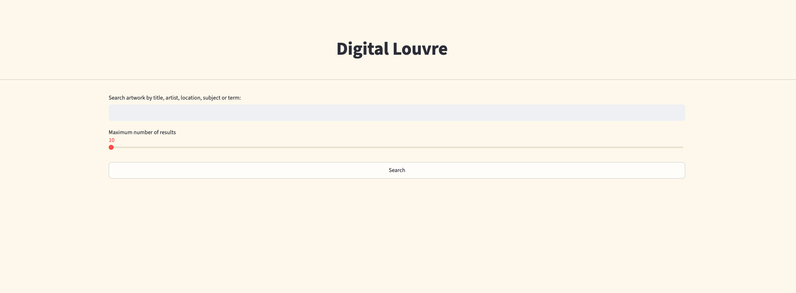
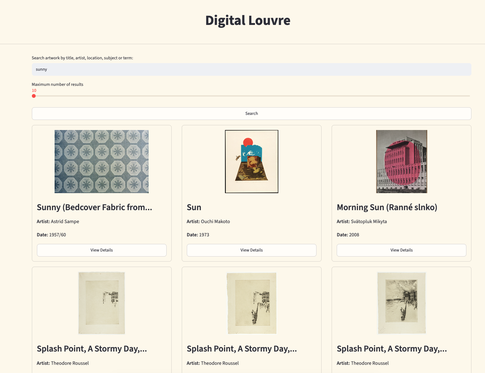
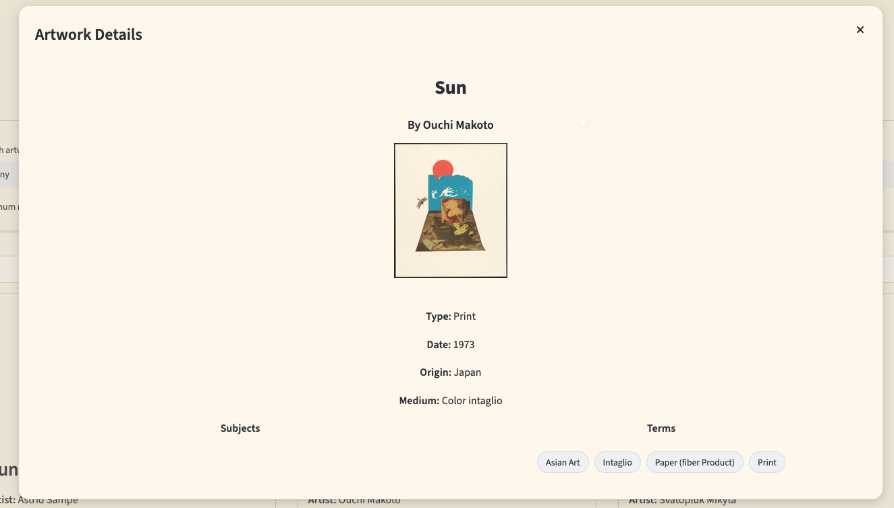
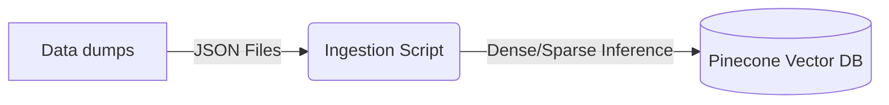
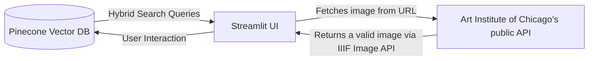

# Digital Louvre: Hybrid Search Engine

An end-to-end interactive web application built with **Python**, **Streamlit**, and **Pinecone**, designed to solve complex information retrieval challenges over cultural heritage datasets.

Instead of relying on isolated text matching or basic vector lookups, this application implements an advanced **hybrid search engine** combining **dense vector embeddings** (semantic understanding) and **sparse lexical representations** (exact keyword matching) powered by the Art Institute of Chicago's public API.


## Try the live production

[](https://digital-louvre.streamlit.app/)

### Screenshots

_An interactive snapshot of the hybrid search engine in action:_






## System Architecture & Data Flow

### Ingestion step



### Data flow from UI to backend



## Key Features

- **Hybrid Search Architecture:** Seamlessly merges semantic similarity (finding art by conceptual themes, mood, or style) with precise lexical keyword matching.
- **Optimised Retrieval Pipeline:** Leverages Pinecone's vector database infrastructure to index high-dimensional embeddings and sparse weight matrices concurrently.
- **Performance Caching:** Built-in state management to prevent redundant API calls, minimize external latency, and protect against rate-limiting.

## Architectural Decisions & Engineering Choices

### 1. Why Hybrid Search?

- **The Problem:** Pure semantic search struggles with strict metadata constraints (e.g., specific artist names, exact accession numbers, or specific publication dates), while pure keyword search fails to capture conceptual queries (e.g., _“sunny places_").
- **The Solution:** Implementing a hybrid retrieval model allows the system to leverage **dense embeddings** to capture contextual meaning alongside **sparse vectors** for exact token precision.

### 2. Streamlit State Management & Performance

- Because Streamlit re-runs the entire execution script on every user interaction, expensive operations—such as remote API requests and embedding generation—are tightly managed using `st.session_state` and caching decorators. This ensures a snappy, low-latency user experience.

### 3. Modular Data Pipeline

- The project separates data ingestion/transformation logic from the presentation layer. Raw JSON payloads from the Art Institute Of Chicago API are normalised, structured, and batch-upserted into Pinecone, ensuring clean metadata filtering capabilities (e.g., filtering by department or date range).

### 4. Embedding Models Selection

- _Dense Embedding Model:_ **llama-text-embed-v2**
  - Helps to identify the conceptual meaning, context, and intent behind search queries.
  - One of the most affordable model within pinecone infrastructure while being one of the top performant (~$0.16/M tokens however since I am on the free tier, it costs virtually nothing)
- _Sparse Embedding Model:_ **pinecone-sparse-english-v0**
  - Helps with precise keyword matching, proper nouns, artist names, and unique codes.
  - It outperforms traditional BM25 as it replaces rigid, statistical heuristics with neural, context-aware token weighting.
  - It is very affordable to use this model (~$0.08/M tokens however since I am on the free tier, it costs virtually nothing)

## Trade-offs & Limitations

- **Streamlit Scalability:** Streamlit is exceptional for rapid data-app prototyping and internal tooling, but it is not optimised for high-concurrency enterprise workloads with complex, custom front-end routing. _(Future improvement: Decouple the backend into a FastAPI service and build a dedicated React frontend)._
- **API Syncing & Freshness:** The ingestion pipeline relies on static batch loads or manual updates. Real-time synchronisation with the live museum catalog would require an asynchronous message broker (e.g., Celery/Redis) or webhooks.
- **Embedding Constraints:** Relying on external embedding providers introduces API dependency, network latency overhead, and potential cost scaling variables as dataset sizes grow.
- **Free Tier Pinecone:** The pinecone index that I am currently using is in its free tier. This means that the data ingestion would not be all the data available in the data dump but rather it only contains a percentage of the data due to the space and inference limitations.
- **Inconsistent Upstream Data:** Real-world museum APIs frequently contain legacy anomalies, such as broken IIIF image URLs, missing artwork titles, or incomplete metadata tags. _(Future improvement: Implement a strict data validation schema during ingestion to filter out or sanitize incomplete records before upserting to Pinecone.)_

## Tech Stack

- **Frontend / UI:** [Streamlit](https://streamlit.io/)
- **Vector Database & Search:** [Pinecone](https://www.pinecone.io/) (Hybrid Search)
- **Data Source:** [Art Institute of Chicago API](https://api.artic.edu/docs/)
- **Core Language:** Python
- **Embeddings Models:**
  - **_Dense Embedding Model:_** llama-text-embed-v2
  - **_Sparse Embedding Model:_** pinecone-sparse-english-v0

## Core Project Structure

```text
museum-hybrid-search/
│
├── src/
│   ├── .streamlit/
│   │   └── secrets.toml    # Secure secrets & API keys
│   ├── components/
│   │   └── components.py   # UI Components
│   ├── helpers/
│   │   └── helpers.py      # Helper functions
│   ├── models/
│   │   └── models.py       # Data types and models
│   └── app.py              # Main Streamlit application entry point
│
├── scripts/
│   └── ingestion-script.py # Data pipeline for API fetching & Pinecone upserting
│
├── pyproject.toml          # Project metadata and dependencies (uv)
└── README.md               # Project documentation
```

## Getting Started & Installation

Follow these steps to run the application locally on your machine.

### Prerequisites

- Python 3.10 or higher
- [uv](https://github.com/astral-sh/uv) (Extremely fast Python package installer)
- A Pinecone account and API key

### 1. Clone the repository

```bash
git clone https://github.com/jasonkianhonting/museum-hybrid-search.git
cd museum-hybrid-search
```

### 2. Ensure the file, secrets.toml exists within the .streamlit folder, within src folder. Ensure that secrets.toml has:

```bash
PINECONE_API_KEY="pinecone-api-key"
PINECONE_HOST_INDEX = "pinecone-host-index"
PINECONE_NAME_INDEX = "pinecone-name-index"
PINECONE_NAMESPACE_INDEX = "pinecone-namespace-index"
DENSE_EMBEDDING_MODEL = "pinecone-dense-embedding-model"
SPARSE_EMBEDDING_MODEL = "pinecone-sparse-embedding-model"
```

### 3. Run ingestion script

```bash
cd scripts
uv run ingestion-script.py
```

### 4. Once data exists in your pinecone index, run the following to start the application

```bash
cd ..
cd src
uv run streamlit run app.py
```

## Glossary

**BM25 (Best Matching 25)** A popular ranking algorithm used by search engines to estimate the relevance of documents to a given search query, built on top of the traditional TF-IDF(Term Frequency-Inverse Document Frequency) framework.

**Dense Embedding:** A high-dimensional continuous vector representation (e.g., generated via llama-text-embed-v2) used in vector databases to capture semantic meaning, context, and conceptual relationships.

**Hybrid Search:** An information retrieval strategy that combines dense semantic retrieval with sparse lexical keyword search to balance conceptual understanding with exact-match precision.

**IIIF (International Image Interoperability Framework):** A standardised set of APIs utilized by cultural heritage institutions (including the Art Institute of Chicago) to dynamically serve, resize, crop, and display high-resolution digital imagery.

**Sparse Embedding:** A high-dimensional vector with mostly zero values (e.g., generated via pinecone-sparse-english-v0) used to represent explicit token importance, exact terminology, and keyword matches.

**Streamlit Session State (st.session_state):** A persistence mechanism native to Streamlit used to store user states, inputs, and cache API responses across script re-runs.

**uv:** An extremely fast Python package installer and project manager written in Rust, utilized in this project for managing environments and executing scripts.

## Credits

Art Institute Of Chicago API - https://api.artic.edu/docs/

Pinecone - https://www.pinecone.io/

Streamlit - https://streamlit.io/
